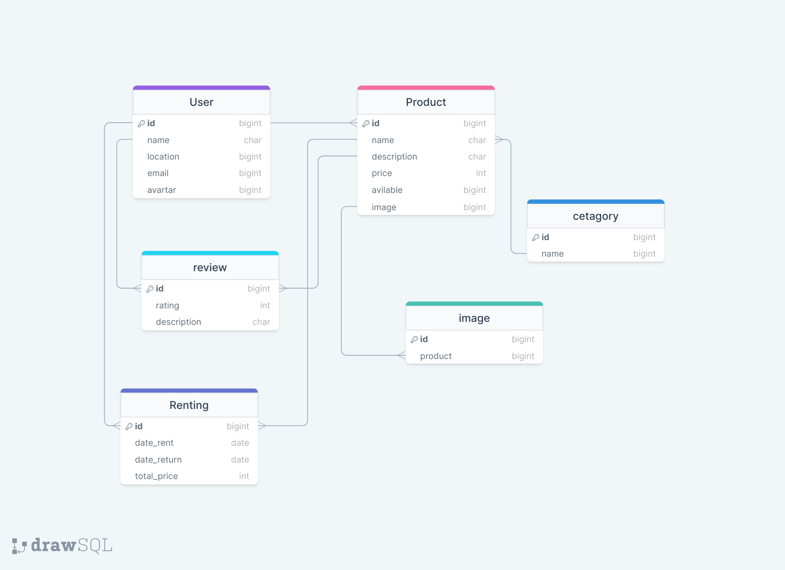
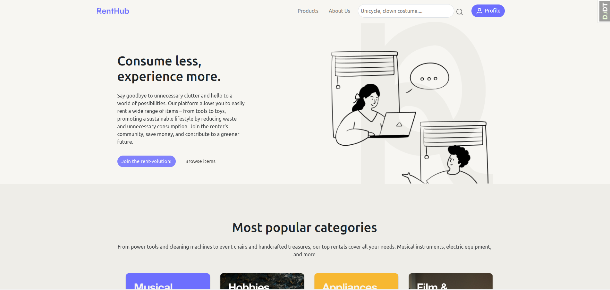
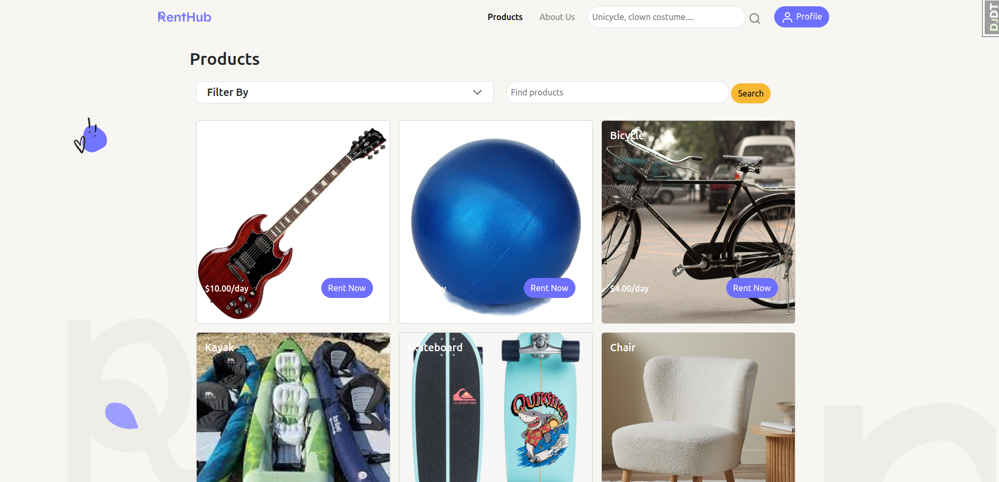
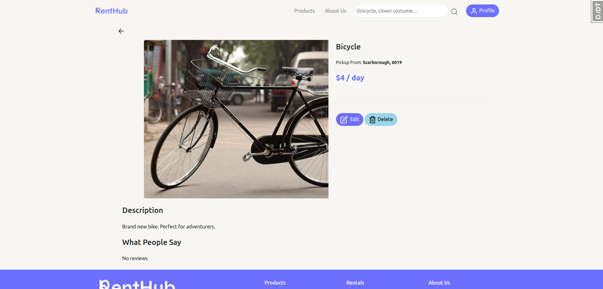
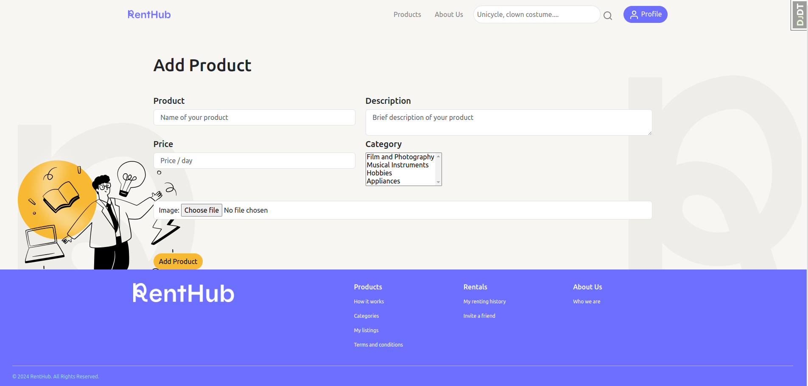

# RentHub

### Consume Less, Experience More.

Renthub is a comprehensive renting application designed to simplify the process of renting and managing properties, vehicles, equipment, and more. Whether you're a property owner, tenant, or rental service provider, RentHub provides a user-friendly platform to streamline the entire rental process.

## [💻 Click here to see the live project!](https://renthub.fly.dev/)

### [Link to Trello Board](https://trello.com/b/56HvnC0w/project-3-renthub)

### [Link to Pitch Deck](https://docs.google.com/presentation/d/1Szp3CJaEdCbqK3vCJiA3HAiuV0FU_Ad_MIn69hnr4b0/edit?usp=sharing)

# 📄 About

How to use Renthub.

1.  Create an account.
2.  Update your details to include your name, location, and avatar.
3.  Add product listings, specifying the price per day, product name and description, and upload photos.
4.  Find the item you're looking to rent by filtering the categories or using the search bar.
5.  Select your desired dates and, ta-da! Your rental is confirmed.
6.  Don't forget to leave a review after you've returned the item! The link will be on your Profile page under below your Rental History.

## ERD:

## 📷 Screenshots

**Landing page:**

**Product Listings:**

**Product Details:**

**Add a Product:**

# 😱 Bugs to fix 💩

-   Some little css problems with smaller formats.
-   Update image isn't working.

## 🚀 Cool tech

-   Django
-   PostgreSQL
-   Python
-   jQuery
-   AJAX
-   Bootstrap
-   HTML and CSS for frontend styling

🚀 Next Steps

-   Implement Google Maps API to enable users to filter results by location and distance
-   Allow users to block off dates for their products, to ensure their product is not rented when they are unavailable
-   Enable users to delete future bookings
