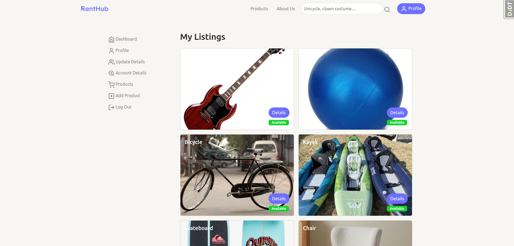

# Renthub

Project 3 of SEI, an  Application for renting products.

# 💻 Click here to see my live project!

GitHub:[Asteroids Finder Project](https://github.com/RentHubGA/renthub)
Render:[Asteroids Finder Render](https://https://renthub.fly.dev)
# 📄 About

How to use Renthub.

-   On the main page you have the option to access the list of products.
-   Go to the home page.
-   Go to About us to see a info about the developers.
-   Search for products by name in the nav bar.
-   Go to the sign up page in 'Join the rent-volution'.
-   Browse items.
-   Go in the most popular sections.

# Add in-app screenshots.

## wireframe:

## screenshots

# ✏️ Planning & Problem Solving

## Planning

-   The idea is to build an application where the user can list and rent all kinds of products. 
-   The user can search for products by name, category and price.
-   The user can add / delete / edit your user.
-   The user can add / delete / edit your product.
-   The user can rent products picking it from a calendar.
-   The user have a dashboard where you can check your products rented, listed, the balance, status of the product and when it's supposed to return.

# 🚀 Cool tech

Javascript, HTML, CSS, Django, PostgreSQL and Bootstrap .

# 😱 Bugs to fix 💩

-   Some little css problems with smaller formats.

# 😭 Lessons learnt

-   Support your team members to achieve common goals.
-   Solve conflicts in code.
-   Clear and open communication is essential for successful collaboration.

# ✅ Future features

-   Adding more than 1 image to the product.
-   Google Maps function for location.
-   Add more filters.
-   Animated buttons.

